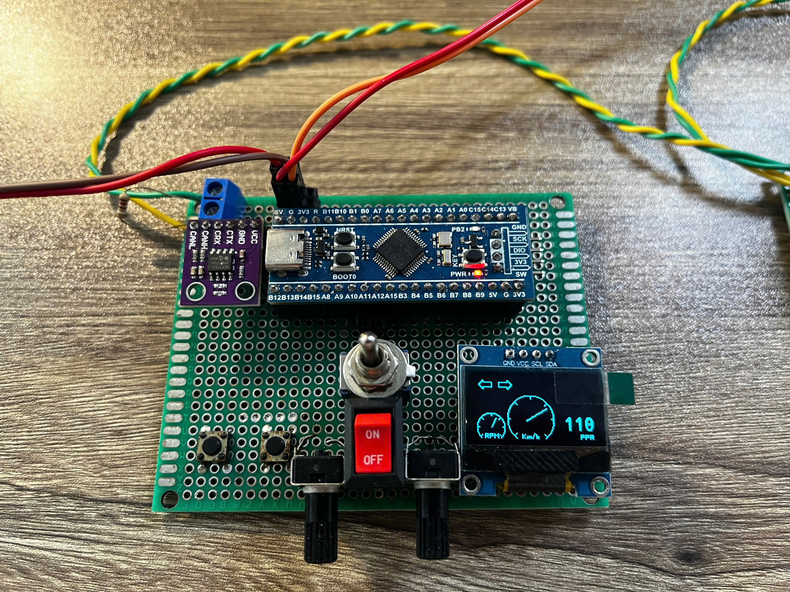
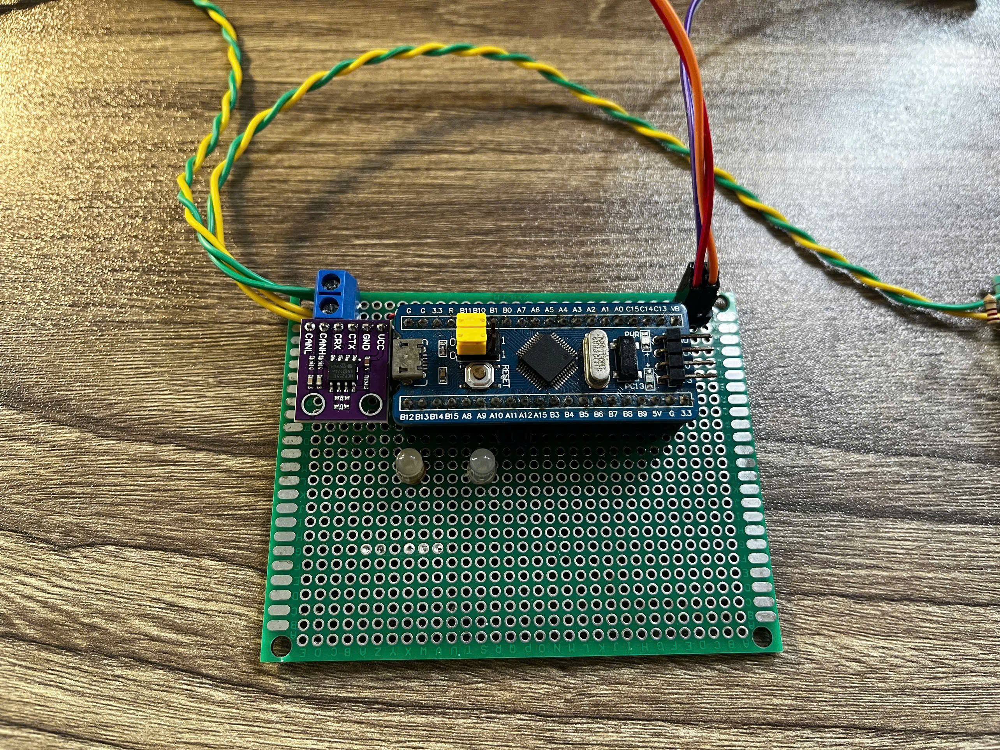
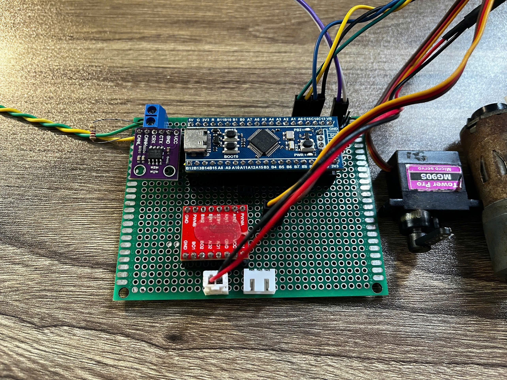

# CAN_AutoSim
CAN Automotive Simulation is a project that simulates a CAN bus network in a car using three STM32F103 nodes

Video demo: https://youtu.be/lX_a0trDY3E

## Project Overview

This project implements a robust CAN bus communication system with error handling, retry mechanisms, and collision avoidance for automotive simulation.

### Nodes


**Node 1: Dashboard** - Main control unit that sends commands to other nodes


**Node 2: Light Node** - Controls vehicle lighting system


**Node 3: Motor Node** - Controls motor and servo systems

## Features

### 1. Error Handling & Recovery
- **Bus-off Recovery**: Automatic detection and recovery from bus-off state
- **Error Notifications**: Real-time monitoring of CAN error states (warning, passive, bus-off)
- **Error Logging**: Statistics tracking for diagnostics

### 2. Reliable Transmission
- **Retry Mechanism**: Automatic retransmission with configurable retry count (default: 5 retries)
- **Mailbox Management**: Checks for free mailbox before transmission
- **Timeout Handling**: Graceful handling of transmission timeouts

### 3. Collision Avoidance
- **Carrier Sense**: CAN hardware automatically monitors bus before transmission
- **Arbitration**: Hardware-based priority arbitration (lower ID = higher priority)
- **Auto Retransmission**: Failed transmissions due to arbitration loss are automatically retried

### 4. Message Validation
- **Checksum Support**: Optional checksum verification for data integrity
- **Timeout Detection**: Monitor for missing messages from other nodes
- **Heartbeat Support**: Optional heartbeat messages for node health monitoring

## CAN Handler API

Each node includes a `can_handler` module that provides:

```c
// Initialize CAN error handler
void CAN_ErrorHandler_Init(CAN_HandleTypeDef *hcan);

// Send message with retry mechanism
HAL_StatusTypeDef CAN_Send_WithRetry(
    CAN_HandleTypeDef *hcan,
    CAN_TxHeaderTypeDef *pHeader,
    uint8_t aData[],
    uint32_t *pTxMailbox,
    uint8_t max_retries);

// Check if CAN bus is in error state
uint8_t CAN_IsError(CAN_HandleTypeDef *hcan);

// Get error counters for diagnostics
void CAN_GetErrorCounters(CAN_HandleTypeDef *hcan, uint32_t *tec, uint32_t *rec);
```

## CAN Message IDs

| Node | Message ID | Description |
|------|------------|-------------|
| Node 1 (Dashboard) | 0x100 | Motor speed control |
| Node 1 (Dashboard) | 0x110 | Servo angle control |
| Node 2 (Light) | 0x210 | Light control command |
| Node 2 (Light) | 0x211 | Light status feedback |
| Node 3 (Motor) | 0x101 | Motor actual speed feedback |

## Configuration

### Retry Configuration
```c
#define CAN_RETRY_MAX           5    // Maximum retry attempts
#define CAN_RETRY_DELAY_MS      10   // Delay between retries
```

### Error Notifications
```c
HAL_CAN_ActivateNotification(&hcan,
    CAN_IT_RX_FIFO0_MSG_PENDING |  // RX message received
    CAN_IT_ERROR_WARNING |          // Error warning state
    CAN_IT_ERROR_PASSIVE |          // Error passive state
    CAN_IT_BUSOFF |                 // Bus-off state
    CAN_IT_LAST_ERROR_CODE);        // Last error code
```

## Hardware Setup

- **Microcontroller**: STM32F103C8T6 (Blue Pill)
- **CAN Transceiver**: SN65HVD230 or TJA1050
- **Baud Rate**: 125 kbps (configurable)
- **Termination**: 120Ω at each end of the bus

## Building the Project

1. Open the project in STM32CubeIDE
2. Build all three node projects
3. Flash each binary to its respective STM32 board
4. Connect CAN_H and CAN_L between all nodes
5. Ensure proper termination resistors are in place

## Troubleshooting

### Bus-off Error
If a node enters bus-off state:
1. Check wiring and termination
2. Verify baud rate matches on all nodes
3. The system will automatically attempt recovery

### Message Loss
If messages are being lost:
1. Check for mailbox overflow (all 3 mailboxes full)
2. Increase retry count if needed
3. Verify RX FIFO is being serviced promptly

### Communication Issues
1. Use an oscilloscope to verify CAN signals
2. Check ground connections between nodes
3. Verify power supply stability

## Future Improvements

- [ ] Add CANopen protocol support
- [ ] Implement network management (Node Guarding)
- [ ] Add bootloader for OTA updates
- [ ] Implement message filtering by ID range
- [ ] Add diagnostic trouble code (DTC) support

## License

BSD 3-Clause License - See STMicroelectronics license in source files.