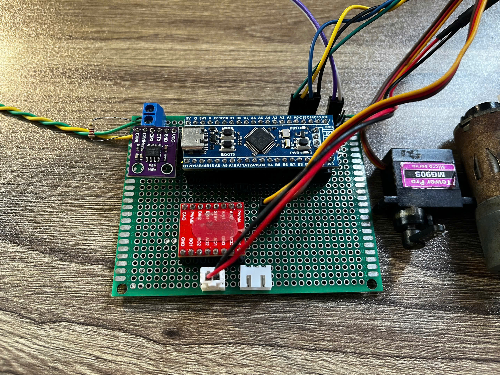

# CAN_AutoSim
CAN Automotive Simulation is a project that simulates a CAN bus network in a car using three STM32F103 nodes

Video demo: https://youtu.be/lX_a0trDY3E

node 1: dashboard

node 2: light node

node 3: motor node